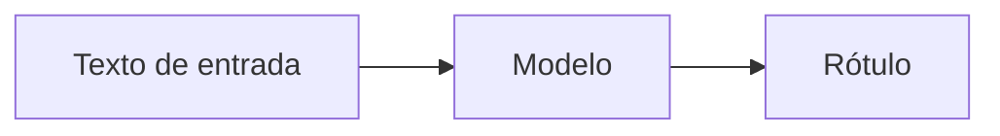
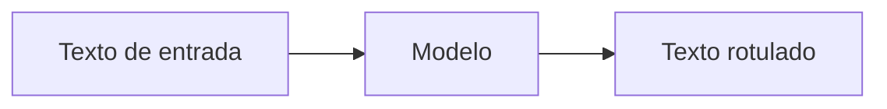
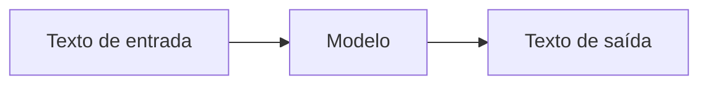

# Capítulo 1: Fundamentos

Antes de usar uma ferramenta, vale a pena entender que tipo de máquina ela é e para que deve ser usada. Muita gente hoje trata um modelo de linguagem como um oráculo ou como um banco de dados que "sabe" coisas. Nenhuma das duas visões está certa, mas nenhuma está completamente errada.

Neste capítulo vamos construir o conhecimento básico necessário, de baixo para cima para entender o que são modelos de linguagem.

## Conceitos Fundamentais

### Origem

Para compreendermos a sofisticação dos modelos de linguagem atuais, é imperativo observar sua evolução histórica. A Inteligência Artificial começou com abordagens simbólicas e baseadas em regras.

Sistemas Especialistas, populares nas décadas de 1970 e 1980, tentavam codificar o conhecimento humano através de árvores de decisão lógicas complexas.


ELIZA, desenvolvida no MIT em 1966, foi um dos primeiros "chatbots", utilizando padrões de substituição de texto para simular um psicanalista.


Embora pioneira, ELIZA não possuía compreensão semântica; operava puramente por reconhecimento de padrões de palavras-chave.

- Você consegue testar Eliza aqui: [Try Eliza](https://sites.google.com/view/elizaarchaeology/try-eliza)

Paralelamente, as redes neurais artificiais tiveram sua gênese no Perceptron, concebido na década de 1950.


fonte: [W3Schools - Perceptron](https://www.w3schools.com/ai/ai_perceptrons.asp)

Inicialmente limitado a problemas linearmente separáveis, o conceito evoluiu para arquiteturas multicamadas que, décadas depois, formariam a base do Deep Learning.

[IBM -Deep Learning](https://www.ibm.com/br-pt/think/topics/deep-learning)


#### NLP

O Processamento de Linguagem Natural (NLP) transitou gradualmente de sistemas puramente gramaticais e estatísticos (como Cadeias de Markov e modelos n-gram) para as redes neurais profundas. A verdadeira inflexão ocorreu quando a área abandonou a tentativa de "ensinar" regras gramaticais aos computadores e passou a otimizar funções matemáticas capazes de inferir a estrutura da linguagem a partir de volumes massivos de dados empíricos.

>*NLP -> Computar coisas com texto*

As tarefas de NLP costumam ser agrupadas em três famílias, segundo o que sai do modelo:

**Classificação** — o texto inteiro entra e sai um único rótulo:

- Sentiment Extraction (análise de sentimento)
- Intent Detection (detecção de intenção)
- Language Detection (detecção de idioma)
- Topic Modeling (modelagem de tópicos)



**Classificação por token (multiclassificação)** — cada token recebe seu próprio rótulo, e a saída tem o mesmo comprimento da entrada:

- Part of Speech Tagging (etiquetagem morfossintática)
- Named Entity Recognition (reconhecimento de entidades)
- Dependency parsing (análise de dependências)
- Constituency parsing (análise de constituintes)



**Geração** — o modelo produz texto novo a partir da entrada:

- Machine Translation (tradução automática)
- Question Answering (resposta a perguntas)
- Summarization (sumarização)
- Text Generation (geração de texto)




[IBM - NLP](https://www.ibm.com/br-pt/think/topics/natural-language-processing)

### O que realmente é um Large Language Model (LLM)

Um Large Language Model é, no fundo, uma função estatística gigantesca treinada para fazer uma única coisa: dado um pedaço de texto, prever qual é o próximo pedaço mais provável. Só isso. Toda a aparente inteligência — escrever código, resumir contratos, explicar física — emerge dessa tarefa simples repetida bilhões de vezes durante o treinamento.

#### Tokens

O texto não entra no modelo como letras. Ele é quebrado em **tokens**, que são fragmentos de palavras. A palavra "computador" pode virar um único token; "anticonstitucionalmente" pode virar cinco ou seis. Em inglês, a regra de bolso é que um token equivale a uns quatro caracteres, ou cerca de ¾ de uma palavra. Isso importa por um motivo muito prático: **você paga por token**, não por palavra ou por caractere. Quem escreve prompts prolixos paga mais e, muitas vezes, recebe respostas piores.

Mas o que é um token _dentro_ do computador? No fim das contas, é apenas um **número inteiro** — um índice numa tabela chamada vocabulário, que o modelo aprendeu durante o treinamento. O modelo não vê letras nem palavras; ele vê uma sequência de inteiros. Quando você digita uma frase, um _tokenizer_ a quebra em fragmentos e troca cada fragmento pelo seu índice. Por exemplo, a frase "Claude é incrível" poderia ser representada assim:

```
Texto:    "Claude"   " é"     " incr"   "ível"
Tokens:   [ 34782 ,   1085 ,   98213 ,   4521 ]
```

Ou seja, quatro tokens, quatro números inteiros. Repare em três detalhes que costumam surpreender quem vê isso pela primeira vez. Primeiro, **o espaço faz parte do token**: " é" (com espaço) é diferente de "é" (sem espaço) e tem outro índice. Segundo, **uma palavra pode quebrar no meio**: "incrível" virou " incr" + "ível", porque o tokenizer aprendeu fragmentos comuns, e não palavras inteiras. Terceiro, **os números são arbitrários** — o índice 34782 não tem significado matemático; é só o endereço daquele fragmento no vocabulário do modelo. Uma dúvida comum é se tokens com significados análogos possuem identificadores próximos (por exemplo, se o token de "gato" estaria numericamente perto do token de "leão"). A resposta é terminantemente não.

O vocabulário é apenas uma tabela de mapeamento estática construída por frequência estatística de caracteres durante a fase de tokenização (frequentemente utilizando algoritmos como Byte-Pair Encoding ou WordPiece). A proximidade numérica no índice não carrega qualquer semântica.

(Os valores acima são ilustrativos; o vocabulário real de Claude tem dezenas de milhares de entradas.)

#### Embedding

É fundamental entender que a numeração dos tokens é arbitrária. Para que o modelo possa operar algebricamente sobre esses dados e extrair semântica, os índices numéricos devem ser projetados em um espaço vetorial contínuo. Esse processo é realizado pela camada de **Embedding**.

A conversão ocorre mapeando cada índice de token para um vetor denso de alta dimensionalidade (frequentemente com milhares de dimensões).


>[!info] Sobre Espaço Vetorial
>**Mas o que é, concretamente, um vetor neste contexto?**
>
Um vetor é puramente uma lista ordenada de números flutuantes (por exemplo, `[0.23, -1.45, 0.89, ...]`). Cada número nesta lista corresponde a uma coordenada que localiza essa palavra em um espaço geométrico abstrato de milhares de dimensões, codificando características semânticas ou sintáticas latentes aprendidas pela rede.

O "significado" não é programado; ele emerge da topologia deste espaço vetorial. Palavras usadas em contextos similares acabam sendo posicionadas geometricamente próximas umas das outras. É neste ponto que entra o conceito fundamental dos **Pesos** da rede neural.

Os pesos são parâmetros numéricos contínuos (matrizes) que conectam as camadas da rede. Durante o treinamento, através do algoritmo de retropropagação (*backpropagation*), a rede ajusta iterativamente bilhões desses pesos para minimizar o erro de sua previsão. A própria matriz de embeddings é um conjunto de pesos treináveis. Assim, o modelo aprende a alinhar os vetores de forma que operações matemáticas sobre eles correspondam a relações lógicas e semânticas do mundo real.

#### Temperatura

A previsão do próximo token não é determinística por padrão. O modelo produz uma distribuição de probabilidades sobre todos os tokens possíveis, e então sorteia um. Dois parâmetros controlam esse sorteio:

- **Temperature** controla o quanto o modelo "arrisca". Temperatura baixa (perto de 0) faz o modelo escolher quase sempre o token mais provável — respostas conservadoras e repetíveis. Temperatura alta espalha as escolhas — respostas mais criativas e mais imprevisíveis.
- **Top-p e top-k** (amostragem nucleus e top-k) limitam o conjunto de tokens elegíveis antes do sorteio, descartando a cauda de opções improváveis.

Vale uma observação importante e atual: os modelos Claude mais recentes (Opus 4.7/4.8, Sonnet 5 e Fable 5) **removeram os parâmetros de amostragem manual** — `temperature`, `top_p` e `top_k` — em favor de mecanismos de raciocínio adaptativo que veremos no Capítulo 4. Ou seja, o conceito de "temperatura" continua útil para entender _como_ um LLM funciona, mas na prática, com os modelos novos, você guia o comportamento por prompt e por nível de esforço — a amostragem passou a ser interna ao modelo, sem um botão de temperatura para você girar.

Do ponto de vista matemático, a Temperatura é um hiperparâmetro aplicado à saída final da rede neural (os _logits_) imediatamente antes de passarem pela função _softmax_ (que os converte em probabilidades que somam 1).

Valores de temperatura abaixo de 1.0 amplificam a diferença entre o logit maior e os demais, tornando a distribuição mais pontiaguda e a escolha mais determinística. Valores maiores que 1.0 achatam a distribuição, distribuindo a probabilidade de forma mais uniforme e, consequentemente, injetando aleatoriedade e "criatividade" na escolha do próximo token. Citamos a temperatura neste ponto porque ela é a ponte direta entre a função puramente matemática de inferência do modelo e o comportamento perceptível do texto gerado.


Finalmente, há a **context window**: a quantidade máxima de tokens que o modelo consegue considerar de uma vez (entrada mais saída). Pense nela como a mesa de trabalho do modelo.

Tudo o que estiver fora da mesa simplesmente não existe para ele. Os modelos Claude atuais trabalham com janelas grandes — até 1 milhão de tokens nos modelos de ponta —, o que é muito, mas não é infinito, e enchê-la tem custo e custa latência.

### Revolução dos Transformers

Nada disso seria possível sem a arquitetura que sustenta os LLMs modernos: o **Transformer**, apresentado em 2017 no artigo "Attention Is All You Need". Antes dele, os modelos de linguagem processavam o texto palavra por palavra, em sequência — o que os tornava lentos de treinar e esquecidos com dependências longas. O Transformer trocou esse processamento sequencial por um mecanismo chamado **atenção** (attention): em vez de ler em fila, o modelo olha para todos os tokens de uma vez e pesa, para cada um, quais dos demais são relevantes. A palavra "ela", por exemplo, consegue "prestar atenção" no nome citado dez linhas antes.

Duas consequências dessa mudança explicam por que os LLMs decolaram. Primeiro, como a atenção processa a sequência inteira em paralelo, o treinamento passou a escalar bem em GPUs — foi o que tornou viável treinar modelos com bilhões de parâmetros sobre boa parte do texto da internet. Segundo, a atenção captura relações de longa distância que as arquiteturas antigas perdiam, e é daí que vem a coerência que faz um LLM parecer "inteligente". Todo modelo Claude é, no fundo, uma pilha de camadas de atenção — o mesmo mecanismo que reaparece no Capítulo 8, quando falamos de _attention_ e do efeito "perdido no meio".


> *Arquitetura do Transformer. Fonte: Yuening Jia, Wikimedia Commons, CC BY-SA 3.0.*

O mecanismo de Self-Attention processa o contexto em etapas algébricas rigorosas, operando sobre três vetores fundamentais derivados do embedding de cada token: Query (Q), Key (K) e Value (V).

* **Query (Q)** representa o que o token atual está "procurando" no resto do contexto.
* **Key (K)** representa o que cada token "oferece" para responder a essas procuras.
* **Value (V)** é o conteúdo semântico real do token que será extraído se houver correspondência.

A operação ocorre calculando o produto escalar (dot product) entre a Query do token focado e as Keys de todos os tokens na janela. O resultado quantifica a relevância (o nível de "atenção") entre as palavras. Este valor é então normalizado por uma função Softmax, gerando pesos de atenção que somam 1. Finalmente, o modelo calcula uma soma ponderada dos Values usando esses pesos. O efeito prático é profundo: a representação final de uma palavra passa a conter o contexto de toda a frase, resolvendo ambiguidades e capturando dependências estruturais de longa distância que arquiteturas lineares falhavam em processar.


> *Self-attention no encoder (Q/K/V). Fonte: dvgodoy, Wikimedia Commons, CC BY 4.0.*

### LLM vs Chatbot

O LLM não é o chatbot, mas é o motor do chatbot. O LLM é uma função pura que recebe tokens de entrada e devolve tokens de saída, e nada mais. Não tem memória entre chamadas, não tem tela, não tem botão de anexar arquivo, não decide sozinho buscar na web.

O **chatbot é o mecanismo**: a interface de conversa, o histórico que _alguém_ reenvia a cada turno, os anexos e a lógica que resolve quando acionar uma ferramenta.


Fazendo uma analogia, O motor (LLM) é o mesmo em toda parte; o que muda de um produto para outro é o carro construído em volta dele.

Para compreender as capacidades do modelo em produção, devemos separar a arquitetura base (o LLM) da aplicação cliente (o Chatbot ou Agente).


A arquitetura do LLM é stateless (sem estado): as redes neurais processam inferências de forma independente. A cada nova requisição, o modelo não retém estado interno persistente das inferências anteriores. A sensação de que o assistente possui "memória" de curto prazo é uma ilusão sistêmica criada pelas camadas de abstração da aplicação cliente. 

A aplicação armazena o histórico da conversa em um banco de dados e, a cada nova interação do usuário, reempacota as mensagens passadas e as reenvia integralmente no prompt. 

O modelo sempre recalcula o contexto inteiro a partir do zero. Compreender essa arquitetura é vital para diagnosticar estouros de janela de contexto e planejar sistemas corporativos de IA.

### O que exatamente é o contexto

Já que o modelo "parte do zero" a cada chamada, vale definir com precisão o que é o **contexto**, porque é um dos conceitos que mais geram confusão. Contexto é _tudo o que você envia em uma única chamada_: o system prompt (as instruções de fundo), o histórico completo da conversa até ali, a mensagem atual do usuário e, quando existem, as definições e os resultados das ferramentas. É esse pacote inteiro que o modelo lê, do começo, antes de gerar cada resposta.
 
O que o modelo sabe, então, vem de duas fontes bem distintas. Uma é o **treinamento**: o conhecimento geral cristalizado nos pesos quando o modelo foi criado — fixo e com data de corte. A outra é o **contexto**: o que você entrega naquela chamada específica — fresco, mas efêmero, porque some quando a conversa termina. Sempre que Claude parece "não saber" algo que você mencionou antes, a pergunta certa é: isso ainda estava no contexto _desta_ chamada? Fixar essa distinção prepara o terreno para a diferença entre contexto e memória, que retomamos no Capítulo 7.

Falta ainda uma peça nesse quadro: entre você e o modelo cru quase nunca há só o contexto — há também o **harness** (sela), a camada de software que embrulha o modelo e decide o que de fato chega a ele e o que ele tem permissão de fazer. É o harness que monta o contexto a cada chamada, executa as ferramentas que o modelo pede, roda o loop agêntico e aplica os **guardrails** — as travas de segurança que filtram entradas perigosas, barram ações destrutivas e validam a saída antes que ela produza efeito no mundo. O ponto a guardar por ora é que o modelo, sozinho, não tem nenhum desses controles: eles vivem no harness em volta dele. Veremos essa camada em detalhe no Capítulo 8, onde ela reaparece como a espinha dorsal de qualquer sistema agêntico confiável.

### Code Interpreters e Capacidades de Código

LLMs são surpreendentemente bons com código, e a razão é simples: código é texto altamente estruturado, e havia muito dele no treinamento. Mas aqui mora uma armadilha que vale deixar explícita — **escrever código e executar código são coisas diferentes**. Um modelo pode produzir um trecho que parece impecável e não roda, porque ele previu um texto plausível, não verificou uma execução. É esse buraco que o **code interpreter** preenche: um ambiente isolado (sandbox) onde o código que o modelo escreve é de fato rodado, e o resultado — inclusive a mensagem de erro — volta para o modelo, que então corrige. Escrever é prever; o interpretador transforma previsão em verificação.

Separado disso, há três _capacidades_ de código que costumam ser confundidas entre si, e nomeá-las ajuda a pedir a coisa certa. **Code completion** é completar o que você já começou a digitar. **Code generation** é produzir um trecho inteiro a partir de uma descrição em linguagem natural. E **code explanation/refactoring** é ler um código que já existe para explicá-lo ou reestruturá-lo. São três tarefas distintas, com prompts distintos — e quem sabe qual das três está pedindo obtém resultados muito melhores.

---

## Referências

- Vaswani et al., *Attention Is All You Need* (2017) — <https://arxiv.org/abs/1706.03762>
- Jay Alammar, *The Illustrated Transformer* — <https://jalammar.github.io/illustrated-transformer/>
- Sennrich et al., *Neural Machine Translation of Rare Words with Subword Units* (Byte-Pair Encoding, 2016) — <https://arxiv.org/abs/1508.07909>
- Naveed et al., *A Comprehensive Overview of Large Language Models* (2023) — <https://arxiv.org/abs/2307.06435>
- IBM, *Deep Learning* — <https://www.ibm.com/br-pt/think/topics/deep-learning>
- IBM, *Natural Language Processing* — <https://www.ibm.com/br-pt/think/topics/natural-language-processing>
- Luzerna (IFC), *Sistemas Especialistas* — <https://professor.luzerna.ifc.edu.br/ricardo-kerschbaumer/wp-content/uploads/sites/43/2018/02/3-Sistemas-Especialistas.pdf>

### Créditos das figuras

- Arquitetura do Transformer — Yuening Jia, *Wikimedia Commons*, CC BY-SA 3.0.
- Diagrama de self-attention (encoder) — dvgodoy, *Wikimedia Commons*, CC BY 4.0.
